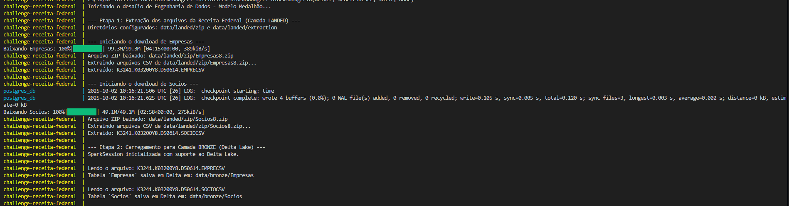
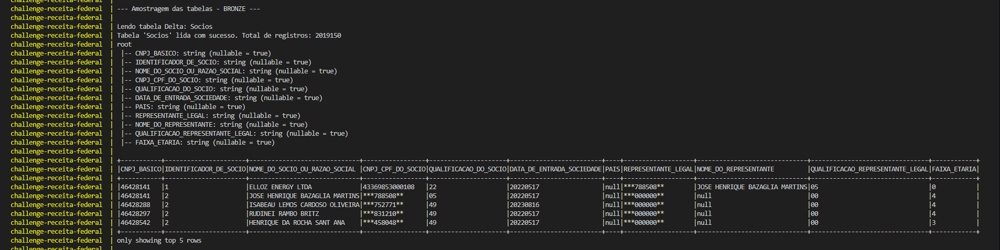
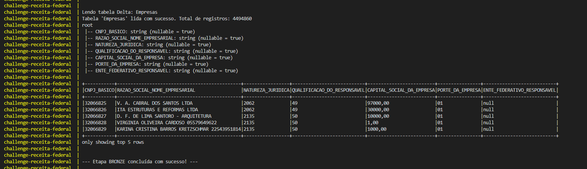
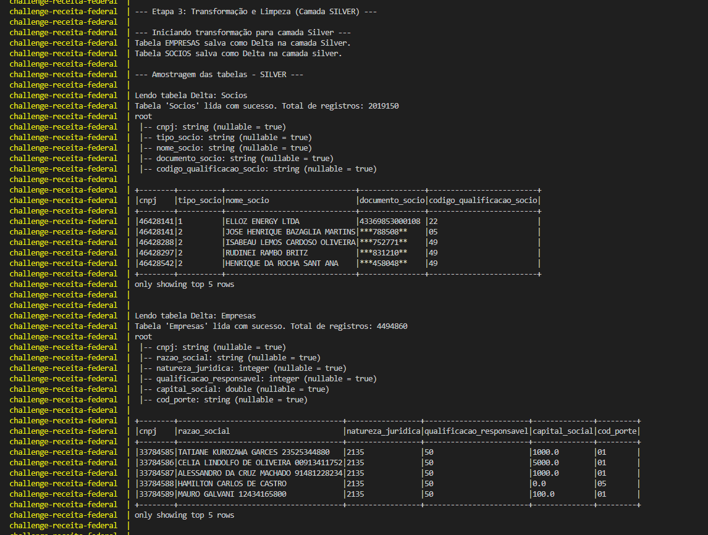
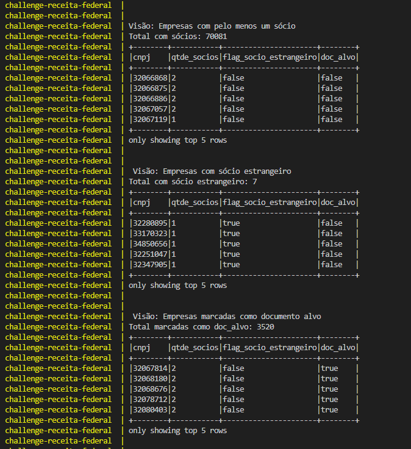

### Desafio - Receita Federal do Brasil

### 1 - Objetivo
O objetivo deste desafio é ingerir, via endpoint, e processar dados abertos sobre empresas brasileiras disponibilizados pela Receita Federal, dados estes que podem sofrer uma defasagem de até três meses, de forma que seja possível atender os requisitos das áreas de negócio.

### 2 - Arquitetura de dados
Este projeto foi construído considerando a arquitetura medalhão, de forma que seja possível garantir performance, qualidade e governança dos dados processados. Após a ingestão dos dados disponibilizados, os mesmos foram salvos em formato Delta lake a fim de garantir atomicidade na escrita e eliminação de dados corrompidos ou inconsistentes (garantia ACID), integridade, possibilidade de 'viagem no tempo', permitido com o histórico de versão dos dados, além de melhorar a performance e permitir indexação.

Segue a relação da estrutura de camadas utilizadas neste projeto:

**Dados brutos** - Camada responsável por recepcionar os dados obtidos após ingestão via endpoint.

- *Landed* - Arquivo bruto, mesmo formato do endpoint<br>
{data/landed/zip}: Primeira recepção dos arquivos ZIP extraídos da Receita Federal<br>
{data/landed/extraction}: Extração do conteúdo dos arquivos ZIP

- *Bronze* - Dado bruto. Estrutura definida e formato otimizado <br>
{data/bronze}: Ingestão dos arquivos, que anteriormente foram extraídos e armazenados em data/landed/extraction, definição de esquema (com base nos metadados disponibilizados pela Receita Federal) e carga em delta.

- **Fonte dos metadados:** [Receita Federal - Metadados CNPJ](https://www.gov.br/receitafederal/dados/cnpj-metadados.pdf)

**Dados refinados** - Camada responsável por entregar objetos de dados de acordo com os requisitos da área de negócio.

- *Silver* - Dado refinado para atender o objetivo do projeto<br>
{data/silver}: Ingestão dos dados brutos, neste momento já armazenados em delta, e criação de novas tabelas delta com a aplicação de esquema que respeite os requisitos da área de negócio.

- *Gold* - Dado agregado<br>
{data/gold}: Neste momento o dado refinado é utilizado para criar uma visão analítica que possa auxiliar a tomada de decisão, isso com base em flags e campos agregados.

### 3 - Estrutura do programa

```
.
└── Challenge-Data-Engineer/
    ├── data/         # Modelo medalhão 
    │   ├── landed/   # Arquivos CSV 
    │   ├── bronze/   # Dados brutos (Delta)
    │   ├── silver/   # Dados limpos e padronizados (Delta)
    │   └── gold/     # Dados agregados e prontos para análise (Delta)
    ├── src/          # Código-fonte e módulos de processamento
    │   ├── __init__.py                  # Inicializa 'src' como um pacote Python 
    │   ├── agg_gold.py                  # Agregações e criação da tabela final (Camada Gold)
    │   ├── database.py                  # Módulo de conexão e carga final no PostgreSQL
    │   ├── ingestion_receitafederal.py  # Baixa e extrai os arquivos da Receita Federal (Camada landed)
    │   ├── load_bronze.py               # Transforma arquivos CSV para Delta (Camada Bronze)
    │   ├── main.py                      # Orquestrador principal do Pipeline
    │   ├── show_deltagold.py            # (Utilitário) Exibe dados da camada Gold
    │   ├── show_deltabronze.py          # (Utilitário) Exibe dados da camada Bronze
    │   ├── show_deltasilver.py          # (Utilitário) Exibe dados da camada Silver
    │   └── transform_silver.py          # Aplica transformações e limpeza (Camada Silver)
    ├── .gitignore                       # Regras de exclusão do Git (ignora /data, /__pycache__, etc.)
    ├── Dockerfile                       # Define a imagem do ambiente Spark/Python
    ├── docker-compose.yml               # Orquestra os serviços (PostgreSQL e Spark)
    ├── requirements.txt                 # Lista de dependências Python
    └── README.md                        # Documentação principal do projeto
```
                                  

### 4 - Como executar o programa

Para que os comandos, via terminal, abaixo sejam executados é necessário ter instalado os seguintes programas: git e docker, este último precisa estar em execução antes que o programa seja iniciado.

 - Clone o reprositório:
    git clone https://github.com/thais6g/Challenge-Data-Engineer.git
 - Navegue até o diretório:
    cd Challenge-Data-Engineer
 - Inicie o programa:
    docker-compose up --build

Este último comando é o responsável por montar a imagem docker, instalar e iniciar cada configuração necessária para a execução do programa.
O início da execução pode demorar devido ao processo de download dos arquivos via endpoint.

### 5 - Teste e Visualização (Acesso ao Banco de Dados)
Há duas opções viáveis para a validação da execução bem sucedida do programa:

* Consulta no diretório de arquivos do seu computador.<br>
    Cada etapa do programa gera outputs que são armazenados de acordo com a sua camada. Navegue até a pasta do seu usuário procure a pasta 'Challenge-Data-Engineer', dentro desta pasta estarão todos os arquivos que foram clonados do git e após a execução bem sucedida do programa a pasta 'data' conterá os arquivos ingeridos e tabelas criadas carregados neste programa.

* Consulta da tabela no banco de dados <br>
    Nessa validação pode-se ser usado, por exemplo, o pgAdmin ou o DBeaver. Para isso considere os seguintes dados:

    | Configuração | Detalhe |
    | :--- | :--- |
    | Host: | localhost |
    | Porta: | 5432 |
    | Banco de Dados: | recfederal_db |
    | Usuário: | admin |
    | Senha: | admin123 |


### 6 - Tecnologias Utilizadas
     Linguagem: Python 3.11.5

     Virtualização: Docker e Docker Compose.

     Processamento:  PySpark.

     Banco de Dados: PostgreSQL.

### 7 - Evidência do processamento<br>

Iniciação da execução. Leitura dos arquivos ZIP e extração do conteúdo na camada landed e carga em delta na camada bronze.<br>



Amostragem - Socios Bronze<br>



Amostragem - Empresas Bronze<br>



Camada silver - refinamento do esquema, com as colunas requeridas e seus devidos tipos de dados.<br>



Camada gold - entrega analítica, com visão final do negócio<br>


Exemplo de análises - Gold<br>



Carga no banco de dados - Postgre<br>

<br>

Consulta da tabela no pgAdmin


